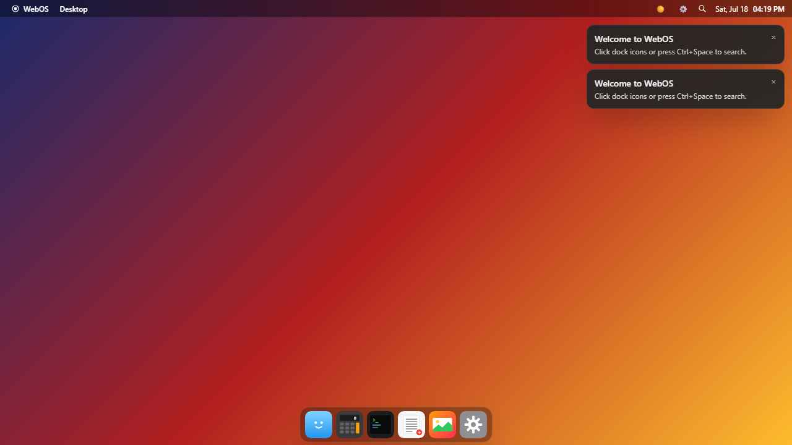
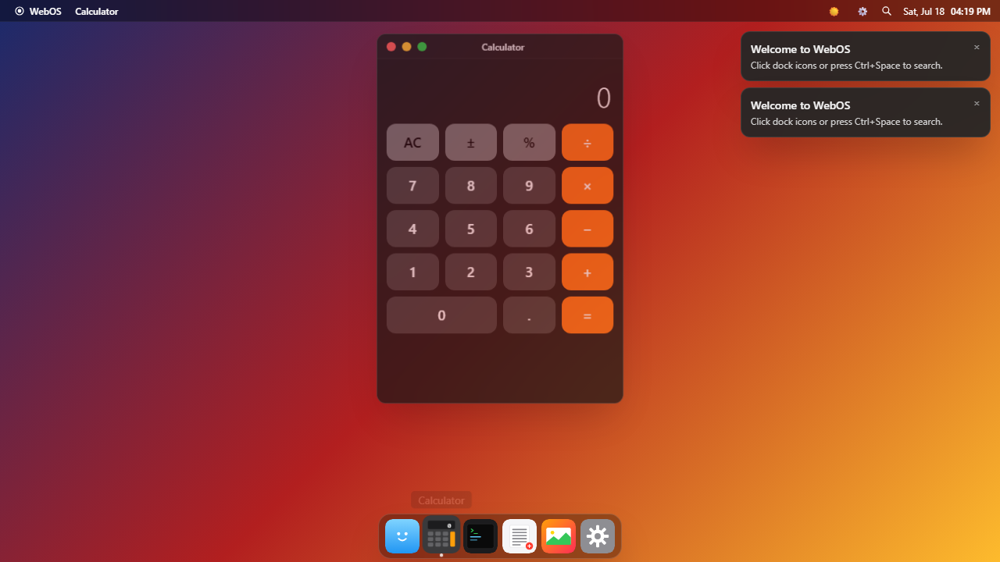
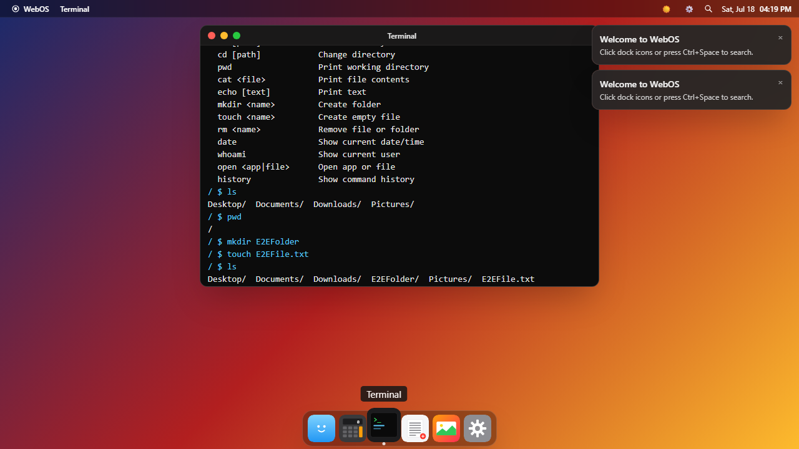
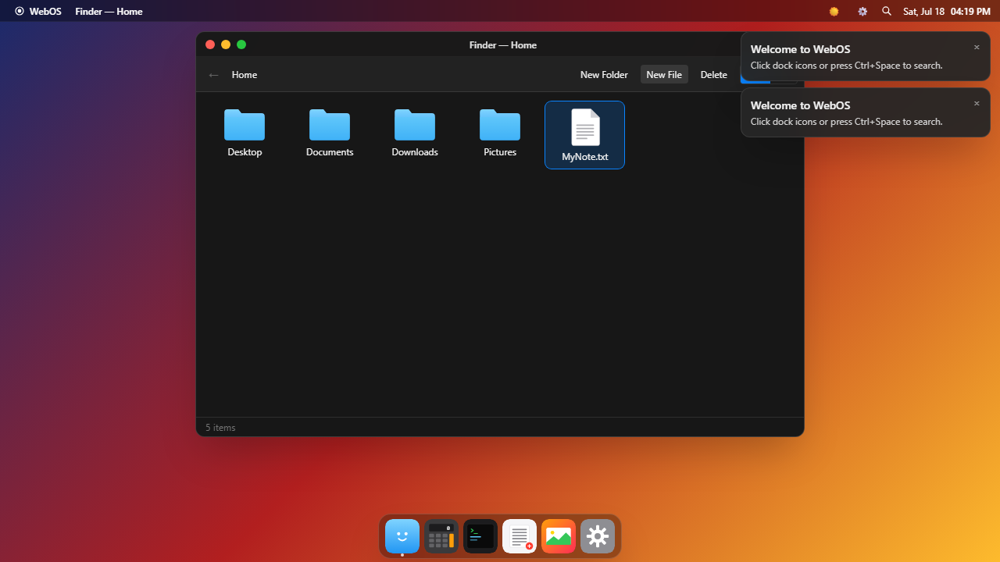
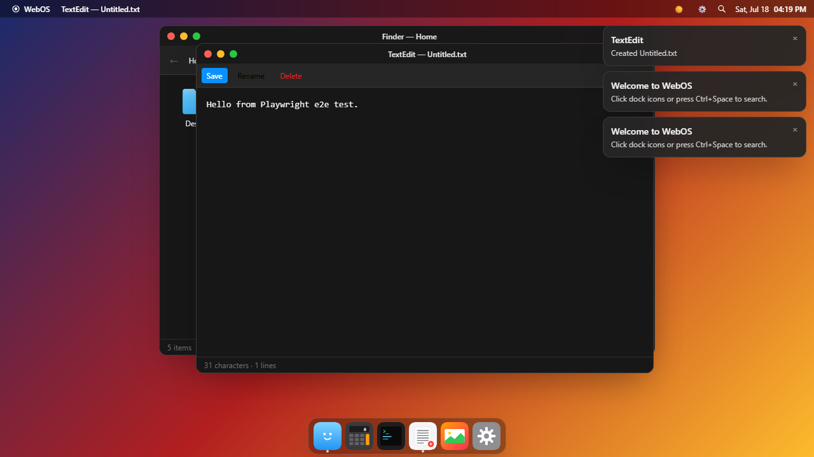
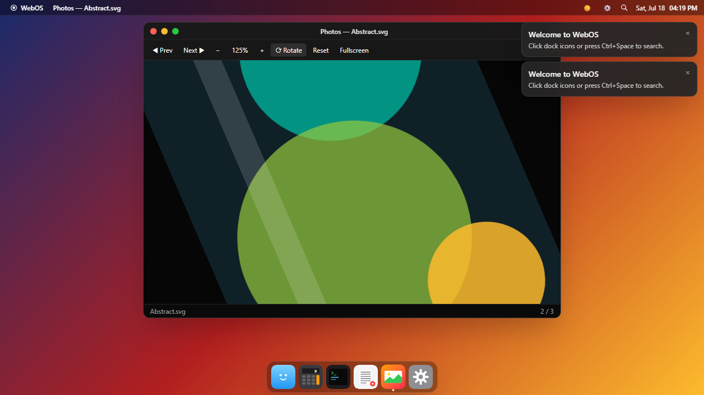
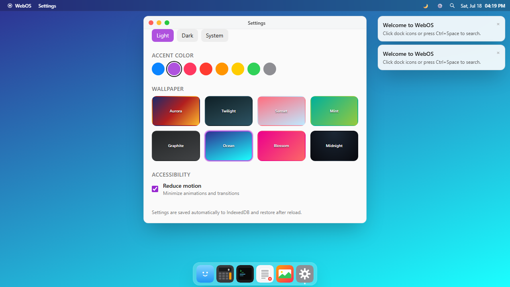
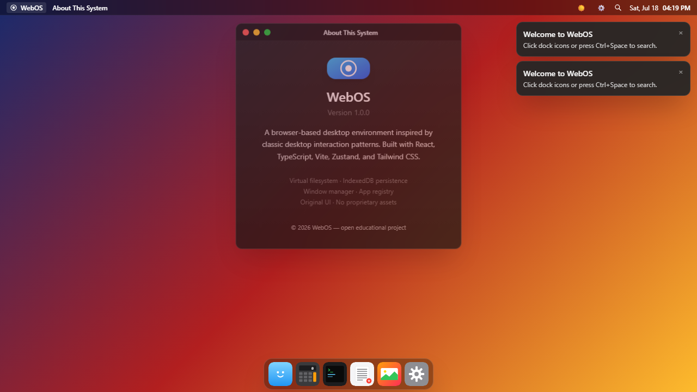
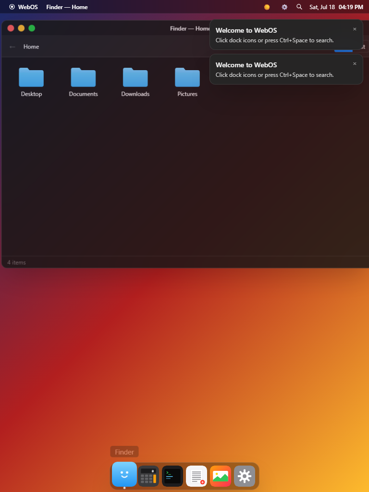

# WebOS

A polished browser-based desktop environment inspired by macOS interaction patterns. Built entirely with web technologies — no server, no host shell access, no external databases.



## Features

- **Desktop shell** — wallpaper, selectable icons, context menu, live clock, top menu bar, magnifying dock
- **Window manager** — open, close, minimize, maximize, focus, z-index stacking, drag, and 8-direction resize
- **Finder** — folders/files, breadcrumbs, grid/list views, create/rename/delete, IndexedDB persistence
- **Photos** — bundled SVG gallery, upload images, zoom, rotate, prev/next, fullscreen
- **Calculator** — keyboard support, history, standard arithmetic
- **Terminal** — safe simulated filesystem with `help`, `clear`, `ls`, `cd`, `pwd`, `cat`, `echo`, `mkdir`, `touch`, `rm`, `date`, `whoami`, `open`, `history`
- **TextEdit** — open, edit, save, rename, delete files from the virtual filesystem
- **Settings** — wallpaper, light/dark/system appearance, accent color, reduced motion
- **Spotlight** — Ctrl/Cmd+Space app and file search
- **Notifications** and **About This System**
- Responsive desktop and tablet layouts
- Persistent desktop state: settings, files, and window positions survive reload (IndexedDB)

## Tech stack

| Layer | Choice |
|-------|--------|
| UI | React 18 + TypeScript (strict) |
| Build | Vite 5 |
| State | Zustand |
| Styles | Tailwind CSS |
| Storage | IndexedDB |
| Unit tests | Vitest + jsdom |
| E2E | Playwright |

## Installation

```bash
npm install
npm run dev
```

Open the printed local URL (default `http://localhost:5173`).

### Scripts

| Command | Description |
|---------|-------------|
| `npm run dev` | Start Vite dev server |
| `npm run build` | Typecheck + production build |
| `npm run preview` | Serve the production build |
| `npm run lint` | ESLint (zero warnings allowed) |
| `npm test` | Vitest unit tests |
| `npm run test:e2e` | Playwright end-to-end suite |

## Architecture

```
src/
  apps/               # Application components + registry
    registry.tsx      # AppDefinition type + register/get helpers
    registerAll.ts    # Side-effect registration of all apps
    Calculator.tsx
    Finder.tsx
    Terminal.tsx
    terminalEngine.ts # Pure command parser (unit-tested)
    TextEditor.tsx
    ImageViewer.tsx
    Settings.tsx
    About.tsx
  components/         # Shell UI (Desktop, Dock, MenuBar, Window, Spotlight…)
  services/
    vfs.ts            # Pure virtual filesystem tree API
    db.ts             # IndexedDB key-value persistence
  store/
    windowManager.ts  # Centralized window state
    vfsStore.ts       # Reactive VFS + auto-persist
    settingsStore.ts  # Appearance preferences + CSS side-effects
    notificationsStore.ts
  types/
  App.tsx             # Boot + shell composition
  main.tsx
```

### Design principles

1. **App registry** — every app is a descriptor (`id`, icon, lazy component, default size, dock/spotlight flags). Dock, Spotlight, and the window host all read the same registry.
2. **Centralized window manager** — one Zustand store owns geometry, z-index, minimize/maximize. The `Window` component is pure presentation + pointer interaction.
3. **Shared VFS service** — pure functions operate on a tree; the store clones + persists after mutations. Terminal, Finder, TextEdit, and Spotlight all use the same tree.
4. **App logic separated from chrome** — apps receive `{ windowId, payload }` and never own drag/resize/title-bar code.
5. **Strict TypeScript** — no `any`, unused locals banned, consistent type imports.

## Applications

| App | Dock | Notes |
|-----|------|-------|
| Finder | ✓ | Multi-instance; open folders via payload |
| Calculator | ✓ | Single instance |
| Terminal | ✓ | Simulated shell only |
| TextEdit | ✓ | Creates files under Documents when untitled |
| Photos | ✓ | Bundled SVGs + uploads to Pictures |
| Settings | ✓ | Single instance |
| About This System | | Via logo menu / Spotlight |

### Terminal commands

```
help  clear  ls  cd  pwd  cat  echo  mkdir  touch  rm  date  whoami  open  history
```

`open` accepts an app id/name or a filesystem path. There is **no** access to the host shell, environment variables, or network.

## Testing

```bash
npm test            # 34 unit tests (VFS, window manager, calculator, terminal)
npm run test:e2e    # Playwright: desktop load, windows, calculator, terminal,
                    # file create, text edit, images, settings, persistence, spotlight
```

E2E also writes screenshots to `screenshots/`.

## Screenshots

| | |
|--|--|
|  |  |
|  |  |
|  |  |
|  |  |
|  | |

## Known limitations

- Window positions are **not** restored after full page reload (settings + VFS are). Session window state lives in memory only.
- Desktop icons only show items inside the VFS `Desktop` folder (not free-form icon placement coordinates).
- Terminal has no pipes, redirection, environment variables, or multi-argument path resolution beyond simple relative/absolute paths.
- Image uploads store data URLs in IndexedDB — large images may hit browser quota.
- No multi-user, auth, networking, or cloud sync by design.
- Touch drag/resize works but is less polished than pointer/mouse.

## License

Educational / open project. Icons and wallpapers are original CSS/SVG — no Apple trademarks or proprietary assets are included.
